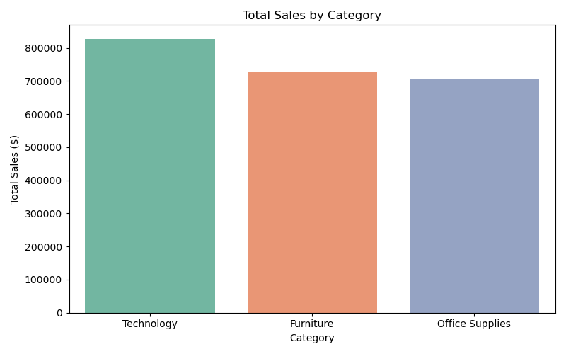
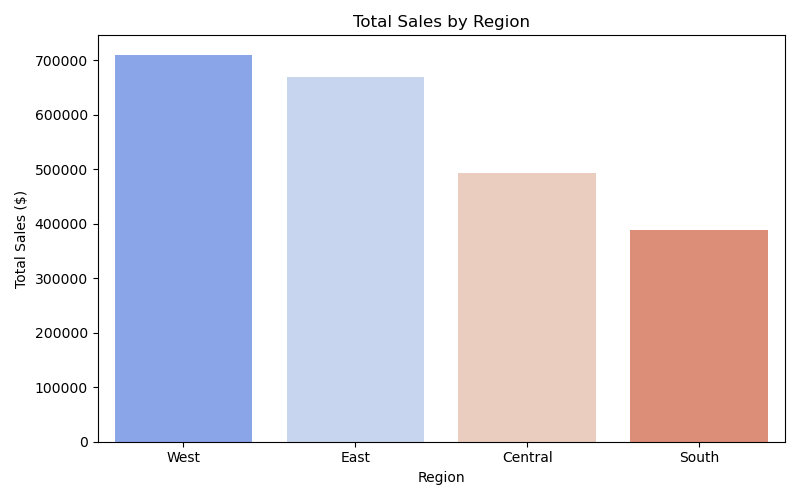
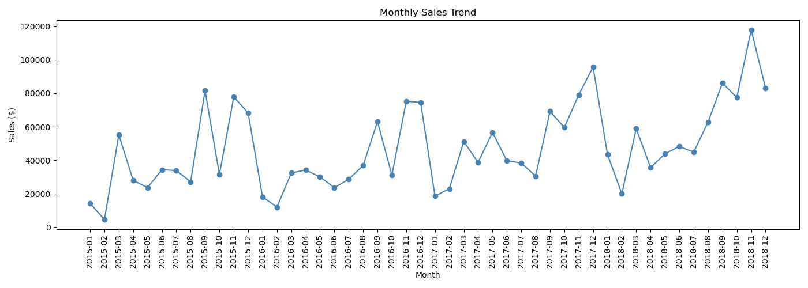
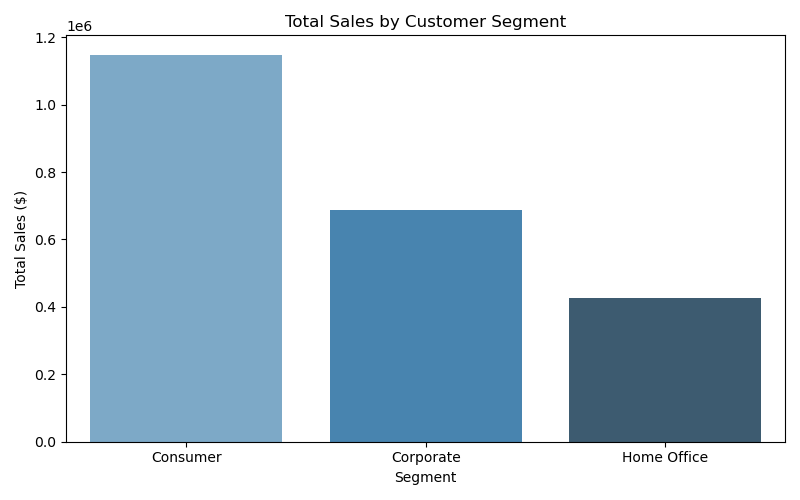

#  AI-Powered KPI Reporting Automation Pipeline

##  Problem Statement
Business teams spend significant time manually compiling KPI reports from raw sales data. This project automates the entire reporting pipeline from data ingestion and KPI computation to AI-generated narrative insights and formatted Excel report generation drastically reducing manual reporting effort.

##  Tools & Technologies
- **Python** (Pandas, NumPy, Matplotlib, Seaborn, OpenPyXL)
- **Anthropic Claude API** (AI-generated executive narrative summaries)
- **Excel** (Auto-generated formatted KPI reports)
- **Dataset:** Superstore Sales Dataset — [Kaggle Link](https://www.kaggle.com/datasets/rohitsahoo/sales-forecasting)

## 📁 Project Structure
```
kpi-reporting-automation/
│
├── data/
│   └── superstore_sales.csv          # Raw dataset
│
├── notebooks/
│   └── kpi_automation.py             # Main automation script
│
├── visuals/
│   └── *.png                         # Generated charts
│
├── output/
│   └── KPI_Report_Superstore.xlsx    # Auto-generated Excel report
│
└── README.md
```

## Key Features
- Automated ETL pipeline using Pandas to extract, transform, and aggregate sales KPIs
- KPI computation across sales, orders, avg order value, category, region, and segment
- **Claude AI integration** to auto-generate executive narrative summaries and recommendations
- Formatted multi-sheet Excel report generation using OpenPyXL
- 4 supporting visualizations for trend analysis

## Visualizations





## How to Run
```bash
git clone https://github.com/itsswatii/kpi-reporting-automation.git
cd kpi-reporting-automation
pip install pandas numpy matplotlib seaborn openpyxl anthropic
python notebooks/kpi_automation.py
```

## Results & Insights
> To be updated after analysis completion.

